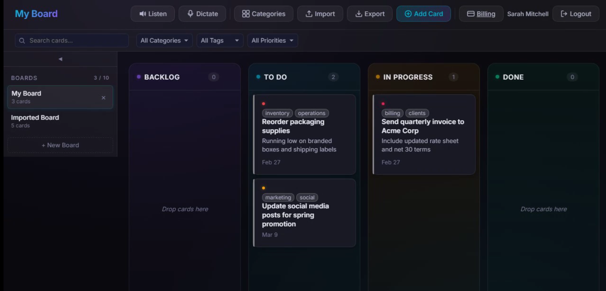
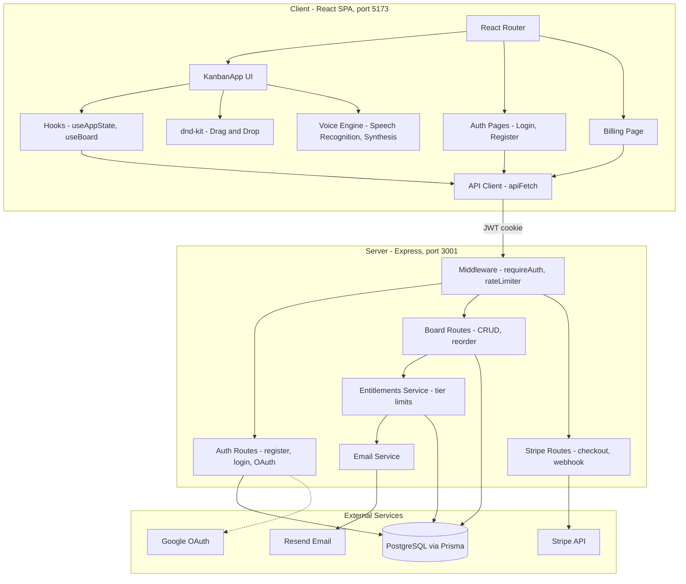
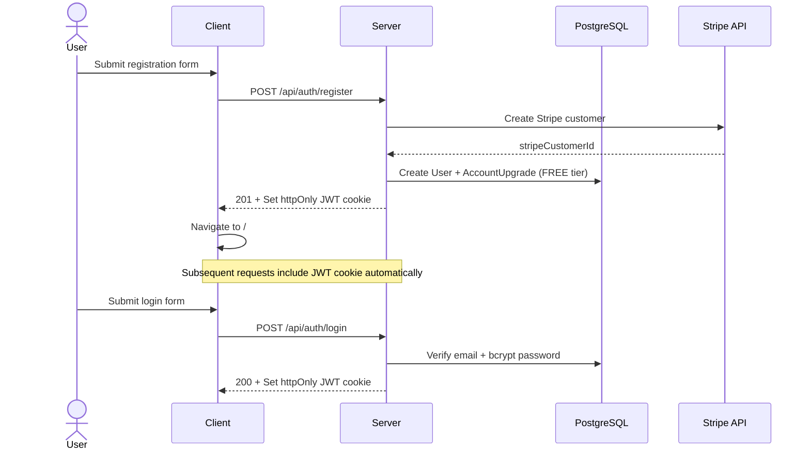
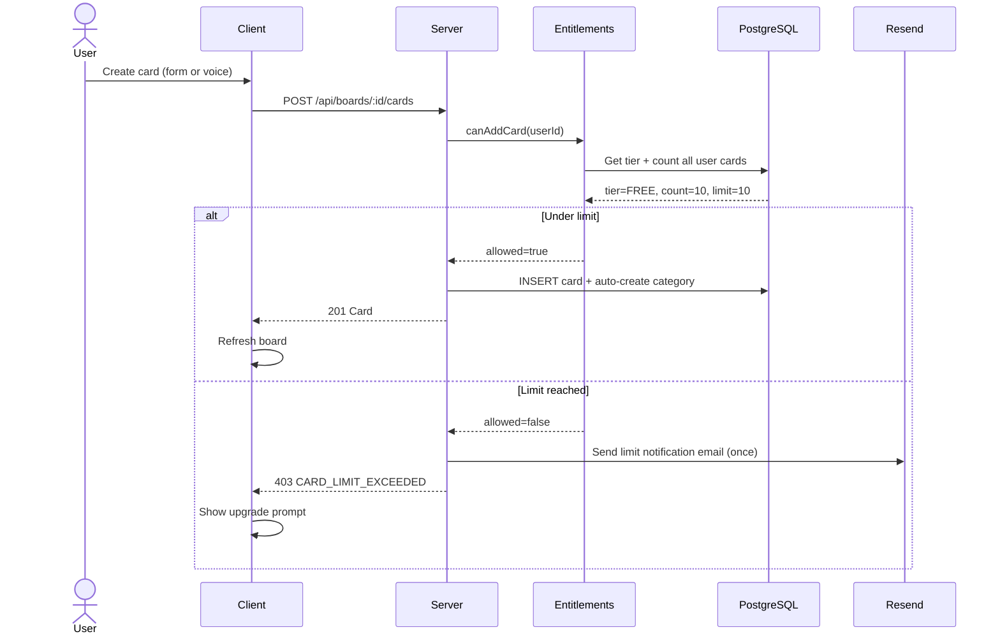
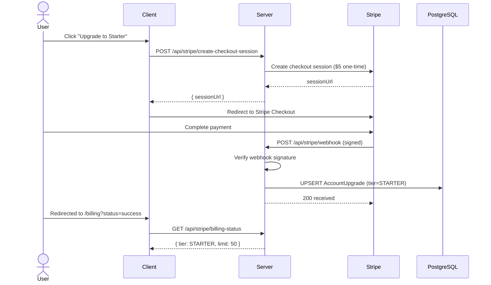
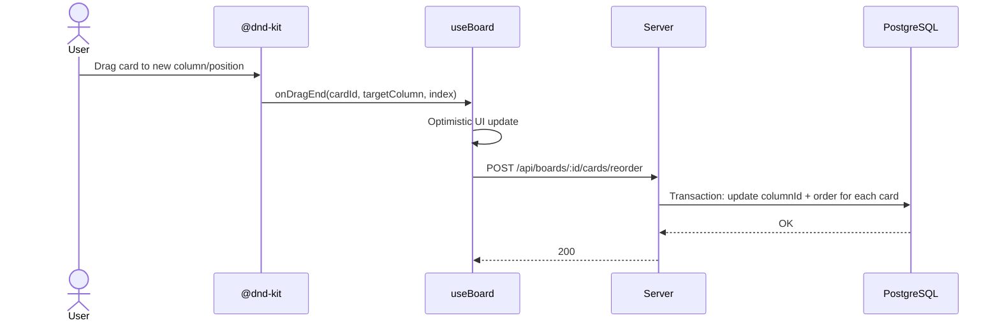

# Personal Kanban

A full-stack Kanban board app for managing personal tasks. Features drag-and-drop, voice dictation, tiered billing, and multi-board support.

## Demo Video
[](demo-output/personalkanban-demo.mp4)
[Open video directly](demo-output/personalkanban-demo.mp4)

## Features

- **Four-column workflow** -- Backlog, To Do, In Progress, Done
- **Drag and drop** -- Reorder and move cards between columns (powered by @dnd-kit)
- **User authentication** -- Email/password registration and login; optional Google OAuth
- **Multiple boards** -- Create, switch, and delete boards from the sidebar
- **Categories and colors** -- Organize cards by category with auto-assigned colors; manage via a dedicated editor
- **Priority levels** -- Low, Medium, High, Urgent with visual indicators
- **Due dates** -- Optional due date per card
- **Free-form tags** -- Add arbitrary tags to any card
- **Voice dictation** -- Create cards by speaking (Web Speech Recognition API)
- **Voice commands** -- Move cards between columns by voice
- **Voice readout** -- Read the board aloud (Web Speech Synthesis API)
- **Billing tiers** -- Free (10 cards), Starter (50 cards, $5), Pro (100 cards, $10) via Stripe Checkout
- **Email notifications** -- Card-limit alerts via Resend (optional)
- **Import / Export** -- Download a board as JSON or import from file (supports legacy formats)
- **localStorage migration** -- One-time import banner for users migrating from the older client-only version
- **Dark themed UI** -- Styled with CSS custom properties and column-specific accent colors

## Tech Stack

### Client (`packages/client`)

| Technology | Version |
|------------|---------|
| React | 18 |
| TypeScript | ~5.6 |
| Vite | 6 |
| @dnd-kit/core + sortable | 6 / 10 |
| react-router-dom | 7 |
| Playwright (E2E tests) | 1.58 |
| ESLint + typescript-eslint | 9 / 8 |

### Server (`packages/server`)

| Technology | Version |
|------------|---------|
| Express | 4 |
| TypeScript | ~5.6 |
| Prisma | 6 |
| PostgreSQL | -- |
| jsonwebtoken (JWT) | 9 |
| Passport + passport-google-oauth20 | 0.7 / 2 |
| Stripe | 17 |
| Resend (email) | 4 |
| bcryptjs | 2.4 |
| Zod (validation) | 3.23 |
| express-rate-limit | 7 |
| Vitest + Supertest (unit tests) | 2.1 / 7 |

## Architecture

### System Overview



### Authentication Flow



### Card Creation with Limit Check



### Stripe Upgrade Flow



### Drag-and-Drop Reorder



## Prerequisites

- **Node.js** >= 18
- **npm** >= 7 (required for workspaces)
- **PostgreSQL** running locally or remotely

## Getting Started

```bash
# Install dependencies (all packages)
npm install

# Set up the server environment
cp packages/server/.env.example packages/server/.env
# Edit packages/server/.env with your values (see Environment Variables below)

# Run Prisma migrations
cd packages/server
npx prisma migrate dev
cd ../..

# Start both client and server in development mode
npm run dev
```

The client will be at `http://localhost:5173` and the server at `http://localhost:3001`.

## Environment Variables

Create `packages/server/.env` from the example file. Required variables are marked with *.

| Variable | Description | Default |
|----------|-------------|---------|
| `DATABASE_URL` * | PostgreSQL connection string | -- |
| `JWT_SECRET` * | Secret for signing JWTs (min 16 chars) | -- |
| `STRIPE_SECRET_KEY` * | Stripe API secret key | -- |
| `STRIPE_WEBHOOK_SECRET` * | Stripe webhook signing secret | -- |
| `STRIPE_STARTER_PRICE_ID` * | Stripe Price ID for Starter tier | -- |
| `STRIPE_PRO_PRICE_ID` * | Stripe Price ID for Pro tier | -- |
| `NODE_ENV` | `development`, `production`, or `test` | `development` |
| `PORT` | Server port | `3001` |
| `CLIENT_URL` | Client origin for CORS | `http://localhost:5173` |
| `GOOGLE_CLIENT_ID` | Google OAuth client ID (optional) | `""` |
| `GOOGLE_CLIENT_SECRET` | Google OAuth client secret (optional) | `""` |
| `RESEND_API_KEY` | Resend API key for email notifications (optional) | `""` |

## Scripts

### Root (runs both packages)

| Command | Description |
|---------|-------------|
| `npm run dev` | Start client and server concurrently |
| `npm run build` | Build the client for production |
| `npm run lint` | Lint the client |
| `npm test` | Run server unit tests then E2E tests |
| `npm run test:server` | Run server unit tests (Vitest) |
| `npm run test:e2e` | Run Playwright E2E tests |

### Client (`packages/client`)

| Command | Description |
|---------|-------------|
| `npm run dev` | Start Vite dev server with HMR |
| `npm run build` | Type-check then build for production |
| `npm run preview` | Preview the production build |
| `npm run lint` | Run ESLint |
| `npm run test:e2e` | Run Playwright E2E tests |

### Server (`packages/server`)

| Command | Description |
|---------|-------------|
| `npm run dev` | Start server with tsx watch (auto-reload) |
| `npm run build` | Compile TypeScript |
| `npm test` | Run Vitest unit tests |
| `npm run test:watch` | Run Vitest in watch mode |

## Project Structure

```
personal-kanban/
  package.json                # Root — npm workspaces config
  packages/
    client/                   # React SPA (Vite)
      src/
        App.tsx               # Routes: /login, /register, /billing, / (protected)
        KanbanApp.tsx         # Main kanban board UI
        api/                  # Server API client (auth, boards, stripe)
        components/
          Auth/               # LoginPage, RegisterPage, ProtectedRoute
          Billing/            # BillingPage with tier cards
          Board/              # Board with drag-and-drop context
          Column/             # Single column with droppable area
          Card/               # Task card component
          CardModal/          # Create / edit card dialog
          Toolbar/            # Top bar (add card, voice, import/export)
          Sidebar/            # Board list and switching
          CategoryManager/    # Category editor modal
          CategoryBadge/      # Colored category label
          PriorityIndicator/  # Priority dot/icon
          DragOverlay/        # Ghost card while dragging
          Toast/              # Toast notification
          ImportBanner/       # localStorage migration prompt
        contexts/             # AuthContext, ToastContext
        hooks/                # useAppState, useBoard, useDragAndDrop, useVoiceDictation, useVoiceReadout
        utils/                # colors, export, migration, parseCardTranscript, parseVoiceCommand
        types/                # TypeScript interfaces
        constants/            # Column definitions
      e2e/                    # Playwright E2E tests
      playwright.config.ts
    server/                   # Express API
      src/
        index.ts              # App entry, routes, test reset endpoint
        config.ts             # Zod-validated env config
        db.ts                 # Prisma client
        routes/
          auth.ts             # Register, login, logout, Google OAuth, /me
          boards.ts           # Board and card CRUD, reorder
          stripe.ts           # Checkout sessions, webhooks
        middleware/
          auth.ts             # requireAuth (JWT verification)
          rateLimiter.ts      # Auth endpoint rate limiting
          errorHandler.ts     # Global error handler
          ensureStripeCustomer.ts
        services/
          entitlements.ts     # Tier limits and card counting
          emailService.ts     # Resend email notifications
      prisma/
        schema.prisma         # Database schema
        migrations/           # Prisma migration history
```

## Database Schema

- **User** -- email, password (hashed), optional Google ID, Stripe customer ID
- **AccountUpgrade** -- tier (FREE / STARTER / PRO), Stripe payment details, limit email tracking
- **Board** -- title, belongs to a user
- **Card** -- title, description, category, priority, due date, tags, column, sort order
- **Category** -- name + color, unique per board

## Deployment

The client builds to a static bundle (`packages/client/dist/`). The server is a Node.js Express app. Both need to be deployed:

1. **Database**: Provision a PostgreSQL instance and run `npx prisma migrate deploy`
2. **Server**: Deploy `packages/server` as a Node.js service with the required environment variables
3. **Client**: Build with `npm run build` and serve `packages/client/dist/` via a CDN or static host, with API requests proxied to the server
